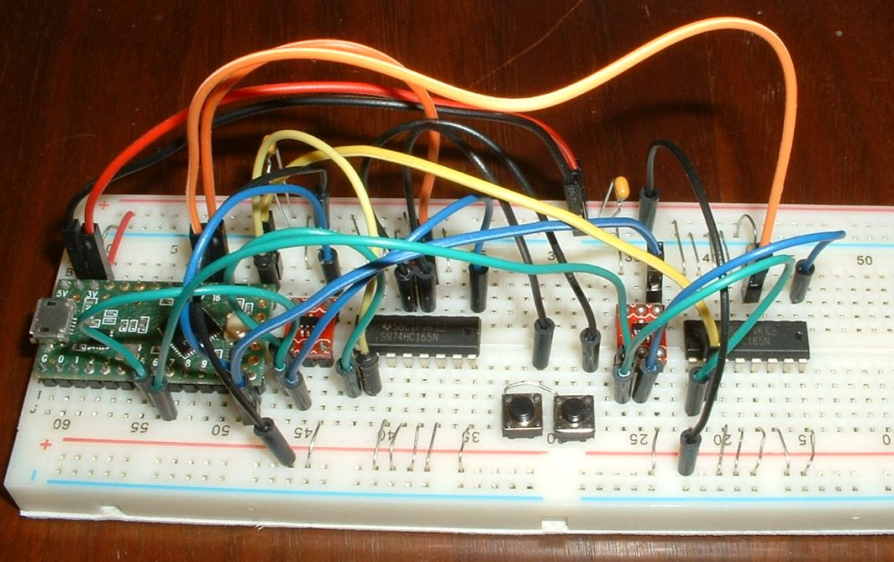

# shiftRegs overview
The following folders where used to develop shift-register circuits and firmware.
The folders contain schematics, sketches, and pictures of breadboards.
* sr1_tri-state/
* sr2_read_loop/
* sr3_strobe_loop/
* sr4_keys/
* sr5_dodohand_PCB/

The "sr" prefix means "shift register".
The folders number are ordered from fundamental to practical.
The fist three folders test components.
sr4_keys and sr5_dodohand_PCB contain schematics.

Each sketch was tested on a breadboard with Teensy LC.
The breadboard bus strips are half the breadboard's length, separated by a gap in the center (picture below).
Each breadboard half holds enough electronics for 8 keys:
* one 74HC165 shift registers (DIP)
* one 74AHC1G126 tri-state buffer chip (on red breakout adapter)

# sr4_keys overview
dodohand_BB is a schematic for a proof-of-concept keyboard small enough to fit on a breadboard.
It has indicator LEDs and two rows of keys just like the 52-key PCB.
The sr4_keys.ino sketch demonstrates shift-register keybrd classes as they would be used in DodoHand.

The right row has two photoInterrupt switches, which consist of an IR LED and photo transistor.
A 20mA Teensy pin strobes two IR LEDs.
(The 52-key PCB will use strobe buffers instead.
Adding strobe buffers to the circuit does not affect the firmware.)

# sr5_dodohand_PCB overview
dodohand_PCB is a schematic for the full 52-key circuit used to design the DodoHand PCB.
dodohand_PCB is similar to dodohand_BB with the addition of:
* more keys
* more indicator LEDs
* strobe buffer

Each hand has four SN74HC165N shift registers daisy chained together for a total of 32 input pins.
26 of those input pins are connected to keys, and 6 unused input pins are grounded (26 + 6 = 32).
The orientation of the daisy chain is important:
* the 6 unused input pins go on the [74HC165 with unconnected SER pin](sr5_dodohand_PCB/pdf_schematics/shiftReg_2keys.pdf)

[tutorial_4b_split_keyboard_with_shift_registers.md](https://github.com/wolfv6/keybrd/blob/master/tutorials/tutorial_4b_split_keyboard_with_shift_registers.md) shows how to daisy chain 74HC165s.

# 74HC165 shift registers (sr4_keys, sr5_dodohand_PCB)
74HC165 shift registers read one row of keys.
The 74HC165's are connected to Teensy controller via 6 wires:
* GND
* 3.3v
* CLK
* SS
* MISO
* strobe

Unused 74HC165N input pins are grounded.

# 74AHC1G126 tri-state buffer chip (sr4_keys, sr5_dodohand_PCB)
The keyboard has two rows of shift registers.
The 74AHC1G126 tri-state buffer chip only allows the active row to access the MISO line, so only one row at a time can transmit on MISO.

These pages explain tri-state buffer chips:
* http://www.dorkbotpdx.org/blog/paul/better_spi_bus_design_in_3_steps
* http://www.electronics-tutorials.ws/logic/logic_9.html  (74AHC1G126 is an active-high tri-state buffer)

More details are in the [scan() function](https://github.com/wolfv6/keybrd/blob/master/src/Scanner_ShiftRegsReadStrobed.cpp)

# Polling keys and trackball monitoring (sr5_dodohand_PCB)
The track ball requires constant monitoring.
The scanner polls one row of keys at a time.
Polling consumes 1% of the controller's time.
Which leaves 99% of the time for monitoring the trackball.
1% of the trackball signals are missed due to polling the keys.

Here is the math.
There are two places in the code to monitor the track ball:
* [sketch loop()](sr4_keys/sr4_keys.ino)
* [scan() function](https://github.com/wolfv6/keybrd/blob/master/src/Scanner_ShiftRegsReadStrobed.cpp)

sr4_keys.ino consumes 63 microseconds per scan.
40 of those microseconds are waiting for the photo-transistor to stabilize in the scan() function.

    63 - 40 = 23 microseconds per scan that sr4_keys.ino can not monitor the trackball

A 52-key DodoHand has 4 times more shift registers as sr4_keys.ino

    23 * 4 = 92 microseconds per scan that 52-key DodoHand can not monitor the trackball

A keyboard should be scanned at least every 10,000 microseconds (10 milliseconds).
The remaining time can be used to monitor the trackball.

    92us / 10000us = 0.92% of trackball signals are missed while scanning 52-key DodoHand

# Strobe buffer (sr5_dodohand_PCB)
To achieve fast polling, 26 keys are strobed simultaneously.
By "strobe" I mean power to the IR LEDs is on for a short time while the shift registers read the photo transistors.
Strobing 26 IR LEDs simultaneously requires much current (high fan-out capability):

    All the IR LEDs at DigiKey are at least 20mA.
    IR LED forward voltage: typ. 1.2 at 20 mA
    26 LEDs * 20 mA/(2 LEDs in series) = 260 mA
    26 LEDs *  5 mA/(2 LEDs in series) =  65 mA

The dodohand_PCB schematic powers the IR LEDs with "strobe buffers".
Some strobe buffer candidates are:
* digital buffer
* buffer amplifier e.g. LMC7101
* Schmitt-trigger buffer

Strobe buffers can be connected in parallel if more current is needed.

I don't understand enough electronics to know which strobe buffer would work.
Someone that understands electronics can can figure this out.

# Indicator LEDs on Teensy LC (sr5_dodohand_PCB)
Indicator LEDs connected to Teensy LC would be implemented same as the current DodoHand on Teensy 2
(for really bright indicator LEDs, use the 20mA pins).

# Indicator LEDs on 74HC595 (sr4_keys, sr5_dodohand_PCB)
Indicator LEDs not on Teensy are powered by 74HC595 shift registers.
The 74HC595 is connected to Teensy controller via 2 additional wires:
* SS
* MOSI

74HC595 output pins are rated at 6mA at 5V (datasheet does not list current for 3.3V).
The 74HC595 runs on 3.3 volts from Teensy LC.
74HC595 on 3.3V will reliably light red and yellow LEDs.

I tested a blue LED with 3.4 typ forward voltage and 4.7k current-limiting resistor.
74HC595 lit the blue LED; and it's output pin was 3.3 volts.
A blue LED with a lower forward voltage would be reliable
(e.g. Wurth Electronics Inc, 151053BS04500 is: blue, 2.7 forward voltage, 20mA, 45 deg viewing angle).

Teensy LC's 5-volt Vin was not used because it would add a 9th connecting wire.

74HC165 and 74HC595 together, connect to Teensy controller using a total of 8 wires.
The 8-wire "GearIT Cat 6 Ethernet Flat Patch Cable 7 Feet" is very flexible.
It's available at Walmart if you want to feel the merchandise.

74HC595 does not need a tri-state because it is the only MOSI device on the keyboard.

# Alternative designs
The track ball requires constant monitoring.
There are a few ways to accomplish this.
The simplicity of the daisy chained shift registers, described above, saves development time.
The following alternatives are more complicated.

## Shift register matrix
Each shift register matrix:
* 74HC595 strobes 5 rows, one row at a time
* 74HC165 reads 6 columns before strobe turns off

Compared to daisy-chained shift registers, a shift-register matrix would have 144 fewer solder joints because:
* 20 fewer pull resistors per hand
* 2 fewer 16-pin shift registers per hand

The scan rate would be almost as fast, provided SPI full duplex can be exploited.
One SPI.transfer() can simultaneously:
* shift 74HC165 registers, 74HC595 turn off strobe of current row, and turn on strobe for next row

But simultaneously shifting and turning off strobe might not work because of timing.
Can 74HC165 read the key position reliably, just as the strobe is turning off?

This 2x2 matrix on a breadboard is suitable for key-matrix development and testing:  [tutorial_4c_split_keyboard_with_IOE.md](https://github.com/wolfv6/keybrd/blob/master/tutorials/tutorial_4c_split_keyboard_with_IOE.md).
It's a rabbit hole that would take time to develop.

## Two controllers
Two separate controllers:
* one controller to emulate the DataHand layout
* one controller dedicated to monitoring the trackball

Programming 2 controllers adds complexity.

A second Teensy LC is a little pricey, but not a problem for a prototype.

## PCA9655E I/O expander with interrupts
One I/O expander per 16 keys, for a total of four I/O expanders.
I2C-safe Bi-directional Logic Level Converter between 3.3v Teeny LC and 5v PCA9655Es.

When a key is pressed or released, PCA9655E sends an interrupt signal to Teensy, which then sends commands to the PCA9655E to read input pins.
Trackball signals are missed while the interrupt is processed.
Not a problem because people usually don't mouse and type at the same time.

Interrupts add complexity.
Debugging I/O expander code is hard because I2C protocol adds a level of indirection.

An I/O expander interrupt would require IR LEDs to be on all the time so key changes can be detected.
IR LED life might be 10 years, which is long enough for prototyping.

I2C bus contention for interrupt signal might be an issue.
Although changing keys on two I/O expanders at exactly the same time is rare.

It would have about the same number of solder joints as daisy-chained shift registers because one pull-up resistor per key.
